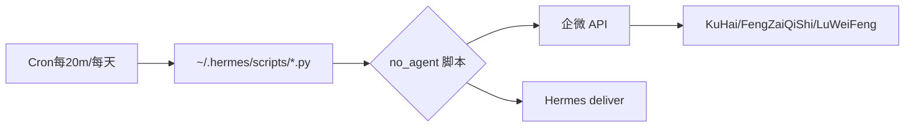

# Session: Lulu's Hermes Migration (2026-06-03)

## 企微应用配置

- 应用名称：超级大脑
- agentId：1000002
- 配置来源：旧 OpenClaw 备份 `/root/openclaw_backup/openclaw.json`
- 运行配置：`/root/.openclaw/openclaw.json`

## 企微用户

| userid | 名字 | 角色 |
|--------|------|------|
| KuHai | 苦海 | Lulu 另一微信号 |
| FengZaiQiShi | 风再起时 | 师父 |
| LuWeiFeng | 陆伟锋 | 老爹 |
| LuHaiTian | 陆海天 | 未使用 |

## 定时任务投递架构

## 关键脚本

- `~/.hermes/scripts/stock_morning_report.py` — 晨报 + 天气 → 企微三人
- `~/.hermes/scripts/stock_closing_report.py` — 收盘报告 → 企微三人
- `~/.hermes/scripts/check_deepseek_balance.py` — DeepSeek 余额 → 微信投递
- `~/.hermes/scripts/hermes_watchdog.py` — 看门狗，异常时通知

## cron 任务清单

| 任务 | 时间 | 模式 | 脚本 |
|------|------|------|------|
| DeepSeek 余额日报 | 每天 09:00 | no_agent | check_deepseek_balance.py |
| Hermes 看门狗 | 每 20 分钟 | no_agent | hermes_watchdog.py |
| 股票晨报 | 工作日 10:00 | no_agent | stock_morning_report.py |
| 股票收盘报告 | 工作日 15:30 | no_agent | stock_closing_report.py |

## 天气报告（待补充城市）

晨报脚本已预留 `WEATHER_LOCATIONS` 字典，待获取城市后取消注释即可启用。
